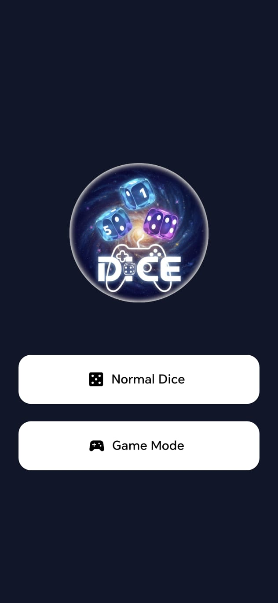
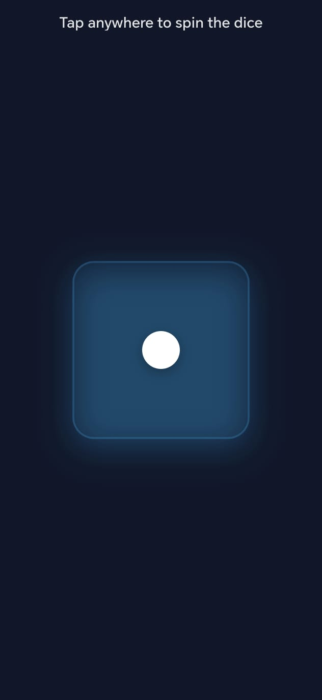
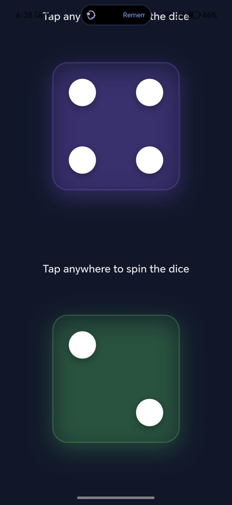
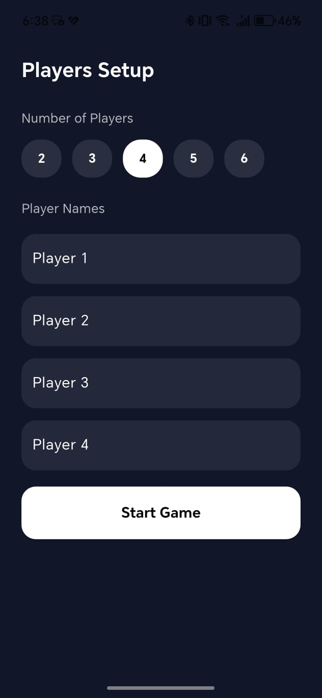
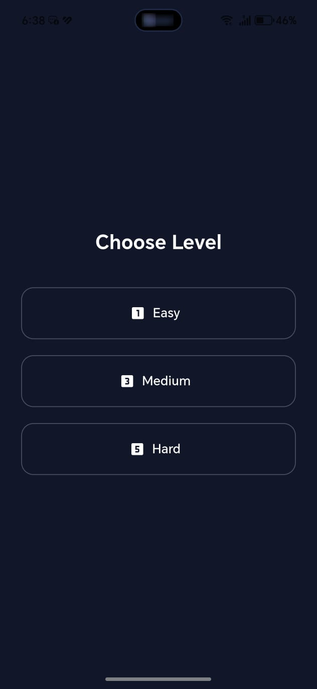
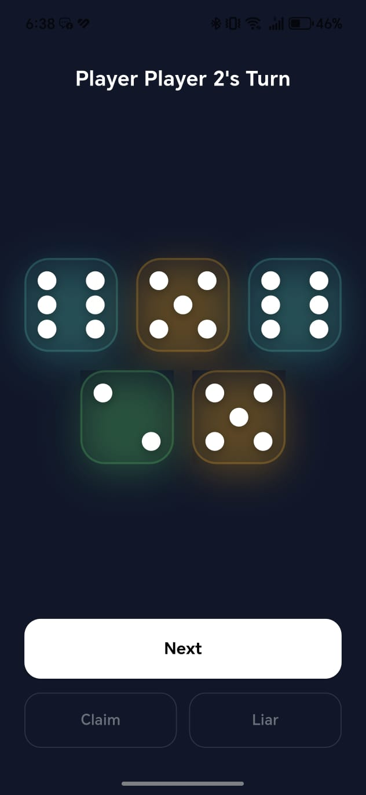
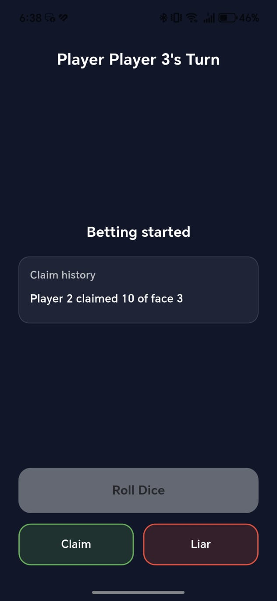
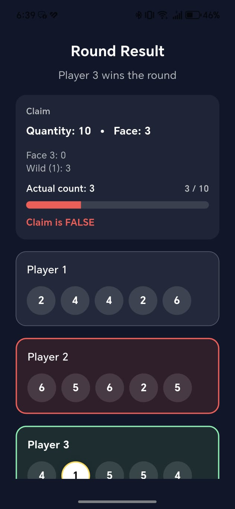
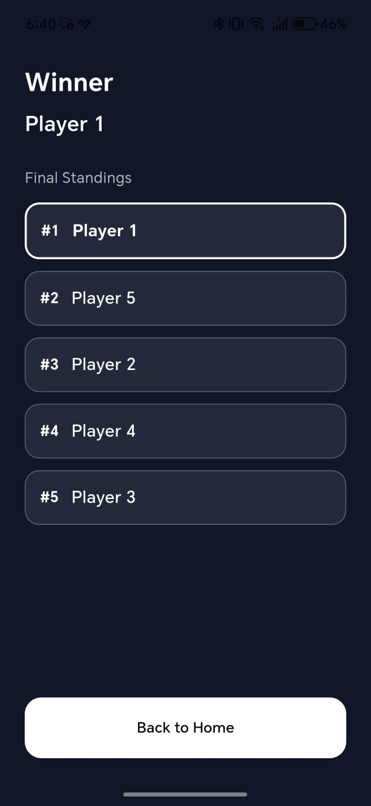

# 🎲 Dice Spinner

A modern Flutter-based dice game app that includes multiple dice modes and an advanced **Liar’s Dice** gameplay experience.
The app focuses on smooth animations, clean architecture, and scalable game logic.

---

## 📱 App Overview

Dice Spinner is a mobile game built with Flutter that offers:
- Classic dice rolling experiences
- Multi-dice modes
- A fully playable **Liar’s Dice** game (Pass & Play)

The project is designed with scalability in mind to support future features such as online multiplayer and advanced AI players.

---

## ✨ Features

### 🎯 General
- Clean and modern UI
- Smooth dice rolling animations
- Responsive layout (mobile-first)
- Localization-ready structure

### 🎲 Dice Modes
- Single Dice Spinner
- Two Dice Spinner
- Animated dice with realistic motion

### 🃏 Liar’s Dice Mode
- Pass & Play (offline multiplayer)
- Custom player names
- Configurable number of players
- Game setup screen
- Turn-based gameplay
- Claim & Call (Liar) logic
- Reveal phase with animated dice
- Winner screen with game summary

### ⚙️ Game Logic
- 5 dice per player
- “1” acts as Wild
- Calling only (no exact bids)
- No Palifico round
- Fully controlled game phases

---

## 🧠 Architecture & State Management

- Feature-based project structure
- Clean separation between:
  - Presentation
  - Domain
  - Data layers
- **BLoC / Cubit** for state management
- Immutable game states
- Predictable state transitions

---

## 🛠 Tech Stack

- **Flutter**
- **Dart**
- **flutter_bloc**
- **ScreenUtil** for responsive UI
- Custom animations
- Clean Architecture principles

---

## 🧩 Project Structure

lib/
 ├── core/
 │   ├── theme/
 │   ├── helpers/
 │   └── widgets/
 ├── features/
 │   ├── home/
 │   ├── normal_dice/
 │   └── liars_dice/
 │       ├── data/
 │       ├── domain/
 │       └── presentation/
 └── main.dart

---

## 📸 Screenshots

    
 
    
 
    

---

## 🚀 Future Enhancements

- Online multiplayer mode
- AI opponents with difficulty levels
- Match history & statistics
- Sound effects & haptic feedback
- Dark / Light theme toggle
- iOS support improvements